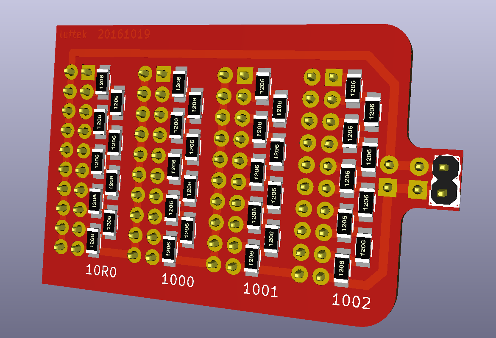
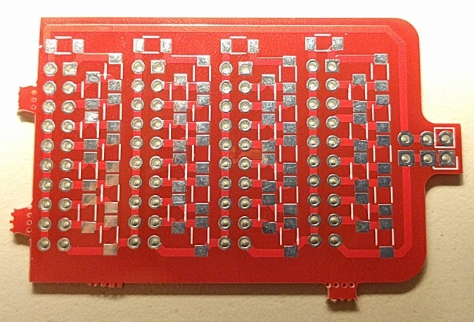
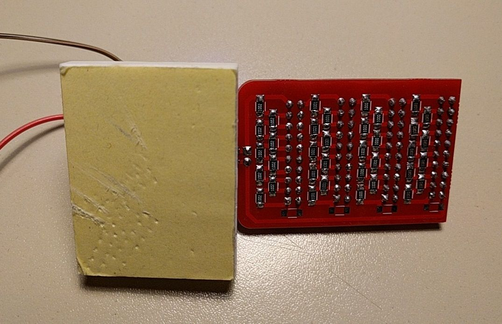

## Breadboard friendly Decade Programmable Resistor Board
Ebay listing: [http://www.ebay.com/itm/122106108566](http://www.ebay.com/itm/122106108566)

more images inside version folders

### 0v2:
Improves on initial board

### 0v1:

### +
- works :)

### -

- 0v1 version has to big pads for SMD
- pads come to close together
- pin headers need bigger pad for easier soldering
- additional markings on back side

